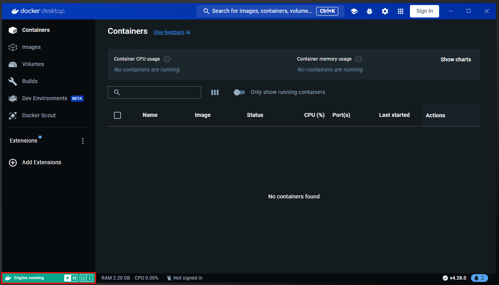
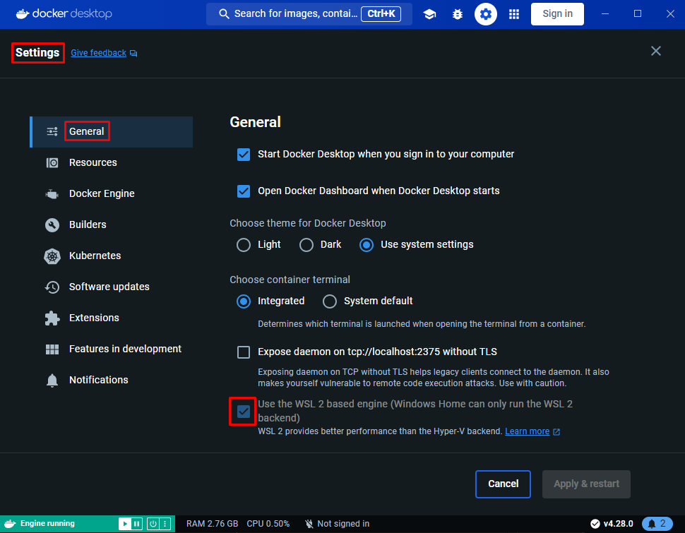
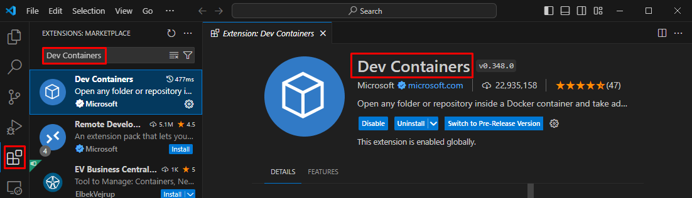

# Bank_Personal_Loan_Modelling
Data Engineering and Data Science Workshop by Deep Wolf AI

# Requirements
1. **Docker Desktop**: This tool allows us to use Docker Engine to create and run containers. It is essential to run this application whenever we are going to work with Docker containers so that Docker Engine starts up. 

    >To download Docker Desktop, you can refer to the following [link](https://www.docker.com/products/docker-desktop/)

2. Run **Docker Desktop** and to verify that it is in the *running* state.

    

3. Enter *Settings -> General* and check that the option Use the *WSL 2 based engine* is selected.

    

4. **Visual Studio Code**: it is the development environment we are going to use because, although containerization of environments is not exclusive to this IDE, the VS Code developers have invested a lot of effort in facilitating the use of Dev Containers and have become leaders in this field.

    > To download Visual Studio Code, you can refer to the following [link](https://code.visualstudio.com/download)

5. **Dev Containers extension**: this VS Code extension is the one that allows working with dockerized development environments.

    

